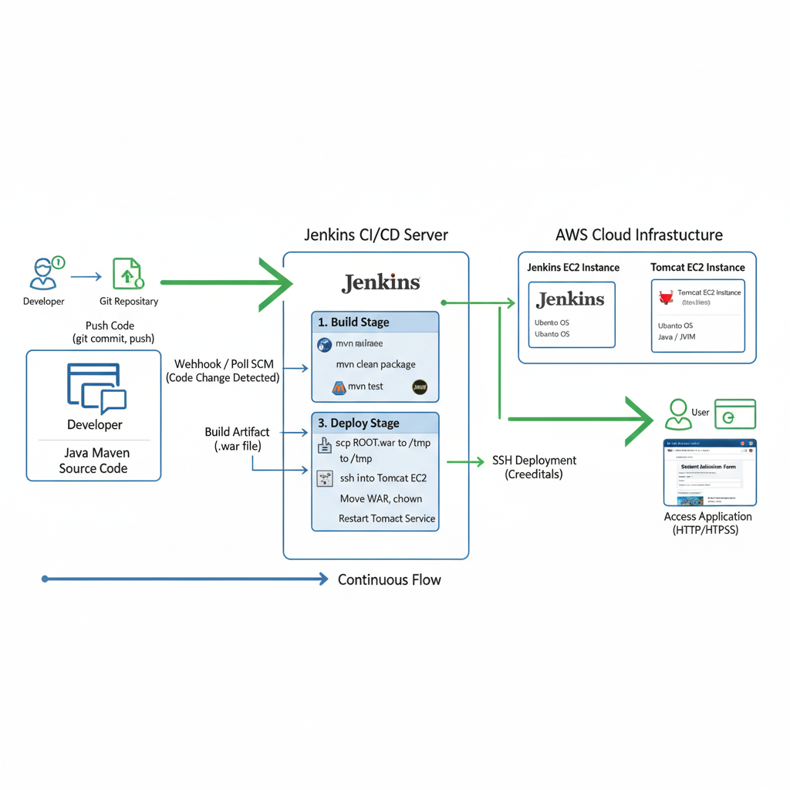

## 🚀 CI/CD Pipeline for Java Maven Project Deployment

This project implements a **Continuous Integration and Continuous Deployment (CI/CD)** pipeline using **Jenkins** to automate the build, test, and deployment of a Java Maven web application to an **Apache Tomcat** server running on an **AWS EC2** instance.


The application is a simple "Student Admission Form" which is deployed after a successful pipeline run.
.png)
-----

### ⚙️ Prerequisites

Before setting up and running this pipeline, ensure you have the following in place:

1.  **AWS EC2 Instances:**
      * One instance dedicated to **Jenkins** (for CI/CD orchestration).
      * One instance dedicated to **Tomcat** (the target deployment server).
      * .png)
2.  **Software Installation:**
      * **Java Development Kit (JDK)** and **Maven** installed on the Jenkins server to build the project.
      * **Apache Tomcat** installed on the target EC2 instance.
      * **Git** installed for source code checkout.
3.  **Jenkins Setup:**
      * **Git Plugin** and **SSH Agent Plugin** (or similar SSH-related plugins) installed in Jenkins.
      * **SSH Credentials** configured in Jenkins for secure deployment to the Tomcat server (e.g., using a private key).
4.  **Source Code:**
      * The Java Maven project source code hosted in a Git repository (as indicated by the `url` in the `Jenkinsfile`).

-----

### 💻 Project Structure (As implied by the `Jenkinsfile`)

The repository contains the standard structure for a Java Maven web application, including a `Jenkinsfile` for the pipeline definition.

| File/Directory | Description |
| :--- | :--- |
| `src/` | Source code directory (Java classes, resources, etc.). |
| `pom.xml` | Maven Project Object Model file, defining dependencies and build process. |
| `Jenkinsfile` | Declarative pipeline script defining the CI/CD stages. |
| `target/*.war` | The resulting web archive file after a successful build. |

-----

### 📝 Jenkins Declarative Pipeline (`Jenkinsfile`)

The pipeline automates the entire process from source code retrieval to application deployment.
.png)

#### **1. Environment Setup**

The `environment` block defines variables used throughout the pipeline.

```groovy
environment {
    SERVER_IP = "75.101.184.251" // Public IP of the Tomcat server
    SSH_CRED_ID = "node-app-key" // Jenkins Credential ID for SSH access
    TOMCAT_PATH = "/var/lib/tomcat9/webapps" // Tomcat's webapps directory
    TOMCAT_SVC = "tomcat9" // Tomcat service name for restart
}
```

#### **2. Stages**

The pipeline consists of three main stages: `checkout`, `Build WAR`, and `Deploy to Tomcat`.

| Stage Name | Description | `Jenkinsfile` Steps |
| :--- | :--- | :--- |
| **`checkout`** | Fetches the latest source code from the Git repository. | `git branch: 'master', url: 'https://github.com/aniket-jagadale/student-registration-CICD.git'` |
| **`Build WAR`** | Builds the Java Maven project into a deployable Web Archive (`.war`) file. | `sh 'mvn clean package'` |
| **`Deploy to Tomcat`** | Transfers the `.war` file to the Tomcat server and deploys it. | 1. Use `sshagent` to securely handle credentials. <br> 2. `WAR_FILE` variable extracts the name of the newly built `.war` file. <br> 3. `scp` command transfers the `.war` file to the `/tmp/` directory on the remote server. <br> 4. Remote `ssh` commands: <br>      - Deletes the old application directory (`ROOT`). <br>      - Moves the new `.war` file to the `webapps` directory and renames it to `ROOT.war`. <br>      - Changes ownership of the deployed file to the `tomcat` user. <br>      - Restarts the Tomcat service to pick up the new deployment. |

-----

### ✅ Successful Deployment

Upon a successful execution of all stages in the Jenkins pipeline , the application is deployed and accessible.

  * **URL:** `http://<SERVER_IP>:<PORT>/` (e.g., `http://75.101.184.251:8080/` as seen in the browser)
  * **Result:** The **Student admission form** page is displayed, confirming a successful deployment. *

-----

### ❌ Troubleshooting Pipeline Failures

The Jenkins build history shows several failed attempts (e.g., runs \#2 to \#7). These failures were occurring primarily in the **`Build WAR`** and **`Deploy to Tomcat`** stages.
.png)
  * **Common Build Failure Causes (`Build WAR`):**
      * Compilation errors in the source code.
      * Missing dependencies (issues with `pom.xml`).
      * Issues with the local Maven installation on the Jenkins agent.
  * **Common Deployment Failure Causes (`Deploy to Tomcat`):**
      * **Incorrect SSH Credentials:** The `SSH_CRED_ID` was likely misconfigured or the private key was incorrect/inaccessible.
      * **Permission Denied:** The user running the SSH commands (e.g., `ubuntu` user) did not have the necessary permissions to:
          * Write to the `/var/lib/tomcat9/webapps` directory.
          * Restart the `tomcat9` service.
      * **Incorrect Service Name/Path:** Misspelling of `TOMCAT_PATH` or `TOMCAT_SVC`.

**Resolution:** The successful run \#8 indicates these issues were resolved, most likely by correcting the SSH credentials, granting proper permissions (e.g., using `sudo` privileges or adjusting user groups/ownership), or fixing any build-related errors.

-----

### ➡️ Next Steps

To further enhance this pipeline, you could integrate:

  * **Unit and Integration Testing:** Add a `Test` stage using Maven commands like `mvn test` before the `Deploy` stage.
  * **Artifact Archival:** Use the `archiveArtifacts` step to save the `.war` file from a successful build.
  * **Notifications:** Configure email or Slack notifications for build status.

Would you like me to elaborate on the steps to set up the SSH credentials in Jenkins for this deployment?